<p align="center">
  <a href="https://fabricadolivro.com.br/" target="blank"></a>
</p>

# Ferramentas Extras

> Todo conteúdo desta seção é opcional e não mandatório para o desenvolvimento.

<details open>
  <summary>
    <strong>WSL</strong>
  </summary>

- [Requisitos mínimos do WSL 2](#requisitos-mínimos-do-wsl-2)
- [Configurações do WSL](#configurações-do-wsl)
- [Limitar recursos usados pelo WSL 2](#limitar-recursos-usados-pelo-wsl-2)
- [Systemd](#systemd)
- [O que é WSLg](#o-que-é-wslg)
  - [Arquitetura do WSLg](#arquitetura-do-wslg)
  - [Como ativar o WSLg](#como-ativar-o-wslg)
- [Integrações](#integrações)
  - [Integração com VSCode](#integração-com-vscode) 
  - [Integração com PhpStorm](#integração-com-phpstorm) 
</details>

<details>
  <summary>
    <strong>Docker</strong>
  </summary>

- [Vantagens & Desvantagens](#vantagens--desvantagens)
- [Dicas & Truques](#dicas--truques)
  - [Otimizar recursos do Docker Desktop](#otimizar-recursos-do-docker-desktop)
  - [Aplicar autoMemoryReclaim no WSL 2](#aplicar-automemoryreclaim-no-wsl-2)
</details>

<details>
  <summary>
    <strong>ZSH</strong>
  </summary>

- [Vantagens do ZSH sobre o Bash](#vantagens-do-zsh-sobre-o-bash)
- [Instale o ZSH](#instale-o-zsh)
- [Configurando o ZSH no Ubuntu Linux](#configurando-o-zsh-no-ubuntu-linux)
- [Reverter para o antigo Bash Shell](#reverter-para-o-antigo-bash-shell)
</details>

<details>
  <summary>
    <strong>Oh My Zsh</strong>
  </summary>

- [Requisitos](#requisitos)
- [Instalação OH-MY-ZSH](#instalação-oh-my-zsh)
- [Temas OH-MY-ZSH](#temas-oh-my-zsh)
- [Plugins OH-MY-ZSH](#plugins-oh-my-zsh)
- [Atualização automática](#atualização-automática)
- [Removendo do Ubuntu Linux](#removendo-do-ubuntu-linux)
</details>

<details>
  <summary>
    <strong>NVM</strong>
  </summary>

- [Conheça o NVM!](#conheca-o-nvm)
- [Instalação do NVM](#instalacao-do-nvm)
- [Comandos Básicos](#comandos-basicos)
- [Migração de pacotes globais](#migração-de-pacotes-globais)
- [Definição de versão por projeto](#definição-de-versão-por-projeto)
</details>

# WSL

O WSL oferece melhor desempenho, compatibilidade total com chamadas do sistema Linux e suporte a ferramentas de
desenvolvimento como Docker e Kubernetes, facilitando a criação e o uso de ambientes de desenvolvimento híbridos
diretamente no Windows.

## Requisitos mínimos do WSL 2

* **Windows 10 Home ou Professional**
    - Versão 2004 ou superior (Build 19041 ou superior).
    - Versões mais antigas requerem a instalação manual do WSL 2. <a href="https://learn.microsoft.com/en-us/windows/wsl/install-manual/" target="_blank">Ver tutorial</a>.
* **Windows 11 Home ou Professional**
    - Versão 22000 ou superior (qualquer Windows 11).
* Uma máquina compatível com virtualização. (Se a sua máquina for mais antiga pode ser necessária habilitá-la na BIOS).
* Pelo menos 4GB de memória RAM (Recomendado 8GB).

## Configurações do WSL

O WSL 2 vem com uma aplicação chamada **Configurações do WSL** que permite configurar o WSL 2 de forma mais fácil e rápida.
Para acessar esta aplicação, basta digitar `wsl` no menu iniciar e clicar em `Configurações do WSL` (*WSL Settings*).

> Caso não esteja familiarizado com o WSL, é altamente recomentado visitar a seção "Bem-vindo ao WSL" no rodapé do menu lateral esquerdo da aplicação.

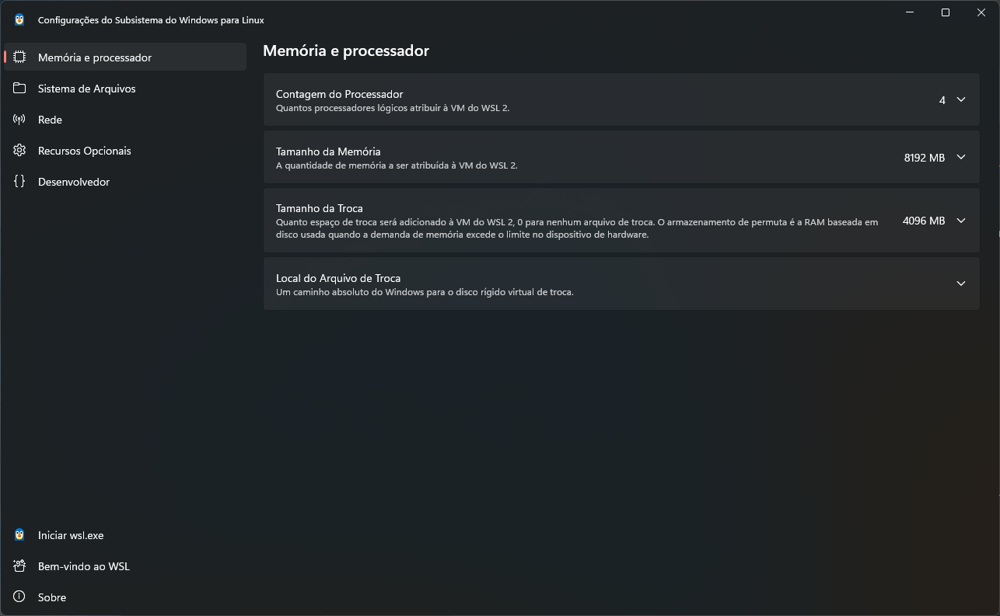

Alguns recursos úteis que podem ser configurados são:

### 1. Limitar recursos usados pelo WSL 2

Podemos dizer que o WSL 2 tem acesso quase que total ao recurso da sua máquina. Ele tem acesso por padrão:

* A 1TB de disco rígido. É criado um disco virtual de 1TB para armazenar os arquivos do Linux (este limite pode ser expandido, ver a área de dicas e truques).
* A usar completamente os recursos de processamento.
* A usar 50% da memória RAM disponível.
* A usar 25% da memória disponível para SWAP (memória virtual).

Se você quiser personalizar estes limites manualmente, crie um arquivo chamado `.wslconfig` na raiz da sua pasta de usuário (`%USERPROFILE%`) e defina estas configurações:

```conf
[wsl2]
memory=8GB
processors=4
```

Estes são limites de exemplo e as configurações mais básicas a serem utilizadas, configure-os às suas disponibilidades.

Para mais detalhes veja esta documentação da Microsoft: <a href="https://learn.microsoft.com/pt-br/windows/wsl/wsl-config#configuration-setting-for-wslconfig" target="_blank">https://learn.microsoft.com/pt-br/windows/wsl/wsl-config#configuration-setting-for-wslconfig</a>. Existem outras configurações que podem ser feitas, como configurações de rede, VPN, liberação de memória, etc.

> 🍀 Para aplicar estas configurações é necessário reiniciar as distribuições Linux. Execute o comando: `wsl --shutdown` (Este comando vai desligar todas as instâncias WSL 2 ativas, basta abrir o terminal novamente para usá-las já com as novas configurações).

Este arquivo `.wslconfig` é um arquivo de configuração global, ou seja, ele afetará todas as distribuições Linux que você tiver instalado no WSL 2, porque você pode ter mais de uma distribuição Linux instalada no WSL 2, como um Ubuntu, um Debian, um Fedora, etc.

### 2. Aplicar recuperação automática de memória no WSL 2

Com o passar do tempo, o WSL pode consumir memória RAM e não liberar, é feito cache de memória para melhorar o desempenho, mas podemos liberar esta memória depois de um tempo. Esta opção é chamada de `autoMemoryReclaim`, ela libera a memória RAM que não está sendo usada através de uma das 2 opções:

* gradual: Libera a memória RAM de forma gradual a cada 5 minutos.
* dropcache: Libera a memória RAM de forma imediata.

Para ativar o `autoMemoryReclaim` manualmente, edite o arquivo `.wslconfig` presente na pasta de usuário do Windows (`%USERPROFILE%`):

```conf
[experimental]
autoMemoryReclaim=gradual
```

> O `.wslconfig` não existirá caso ainda não tenha alterado a configuração padrão do WSL antes, se for o caso, crie um arquivo no Bloco de Notas e salve como `.wslconfig`.

Esta opção só funcionará após reiniciar o WSL. Pare o WSL rodando o comando `wsl --shutdown`. Se o Docker Desktop estiver ativo, imediatamente notará que WSL caiu, apenas clique em "Reiniciar" para subir uma nova instância do WSL.

### 3. Systemd

O WSL é compatível com o `systemd`. O `systemd` é um sistema de inicialização e gestão de serviços amplamente utilizado em distribuições Linux modernas. Ela permitirá que você use ferramentas mais complexas no Linux como snapd, LXD, etc.

Não é obrigatório ativá-lo e a qualquer momento ele pode ser desativado e reativado. Mas, recomendamos que o mantenha ativado, porque ele melhorará a compatibilidade com as distribuições Linux, permitindo que você use mais ferramentas e serviços, como Kubernetes, etc (Ele não é necessário para rodar o Docker).

Para ativá-lo, edite o arquivo `/etc/wsl.conf`:

```conf
sudo vim /etc/wsl.conf
```

Aperte a letra `i` ou `insert` (para entrar no modo de inserção de conteúdo) e cole o conteúdo:

```conf
[boot]
systemd = true
```

Quando terminar a edição, pressione `Esc`, em seguida tecle `:` para entrar com o comando `wq` (salvar e sair) e pressione `enter`.

Toda vez que esta mudança for realizada é necessário reiniciar o WSL com o comando `wsl --shutdown` no DOS ou PowerShell.

### 4. O que é WSLg

O WSLg é uma extensão do WSL 2 que permite rodar aplicações gráficas do Linux no Windows. Ele é uma extensão do WSL 2 e não é necessário instalar nada adicional, basta ter o WSL 2 instalado e atualizado.

Com ele é possível rodar aplicações como Chrome, Firefox, Gedit, IDEs (VSCode, JetBrains) e até aplicações gráficas feitas em Java, Python e etc.

#### Arquitetura do WSLg

O WSLg é uma extensão do WSL 2 que permite rodar aplicações gráficas do Linux no Windows. Ele é uma extensão do WSL 2 e não é necessário instalar nada adicional, basta ter o WSL 2 instalado e atualizado.

Com ele é possível rodar aplicações como Chrome, Firefox, Gedit, IDEs (VSCode, JetBrains) e até aplicações gráficas feitas em Java, Python, etc.

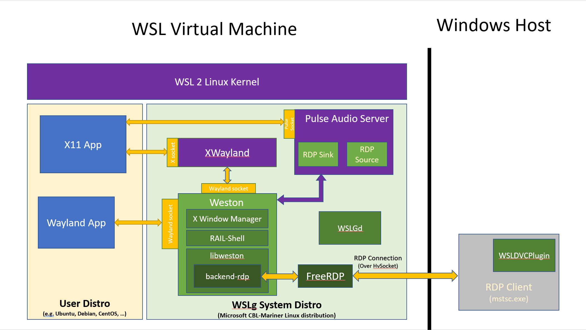

#### Como ativar o WSLg

Para ativar o WSLg, basta ter o WSL 2 instalado e atualizado. Não é necessário instalar nada adicional.

Quando instalar algum aplicativo que dependente de interface gráfica, o WSLg será ativado automaticamente. Vamos a um exemplo:

```bash
sudo apt-get update

sudo apt-get install gedit
```

Abra o Gedit no terminal do WSL 2 digitando `gedit` e ele será aberto no Windows.

Portanto, basta instalar o aplicativo e lança-lo no terminal do WSL 2 para que ele seja aberto no Windows.

## Integrações

### Integração com VSCode

O Visual Studio Code tem uma extensão chamada **WSL** que permite acessar o WSL 2 diretamente do VSCode. Com esta extensão, você pode editar os seus arquivos diretamente no WSL 2, rodar comandos, instalar extensões e muito mais.

Veja mais sobre esta extensão em <a href="https://marketplace.visualstudio.com/items?itemName=ms-vscode-remote.remote-wsl" target="_blank">WSL</a>.

Ao abrir um projeto que está dentro do Linux, é importante que o modo WSL do VSCode esteja ativado. No canto inferior esquerdo do VSCode, clique no botão `><` e selecione `Connect to WSL`. Isto irá conectar o VSCode ao WSL 2 e então poderá abrir o projeto que está dentro do Linux. Você verá que o botão `><` mudará para `WSL: Ubuntu`.


Se o VSCode não estiver desta forma ao abrir projetos dentro do Linux, então o modo WSL não estará ativado e você perderá desempenho ao editar arquivos dentro do Linux, além de não ter suporte para algumas extensões.

> Com a extensão também será possível abrir o projeto no modo WSL diretamente pelo terminal.
> Acesse a pasta do projeto no terminal do WSL e digite `code .`. Isto abrirá o VSCode no modo WSL.
>
> Para que o atalho funcione, você deve iniciar uma nova seção do terminal do WSL após instalação da extensão.

### Integração com PhpStorm

No PhpStorm, você pode abrir diretamente um projeto armazenado no sistema de arquivos WSL e trabalhar com ele como em qualquer outro projeto.

1. Clique em **Abrir** (*Open*) na tela de boas-vindas ou selecione **Arquivo | Abrir** (*File | Open*) no menu principal.
2. Na caixa de diálogo Selecionar caminho que é aberta, selecione a pasta no sistema de arquivos WSL que contém o projeto a ser aberto ou digite o caminho para o local do projeto **\\\wsl$** manualmente.
   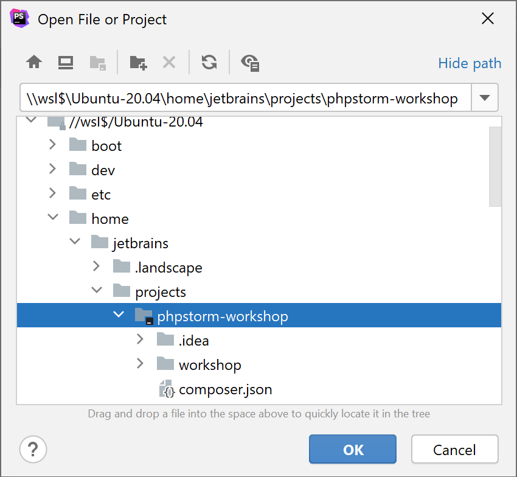
   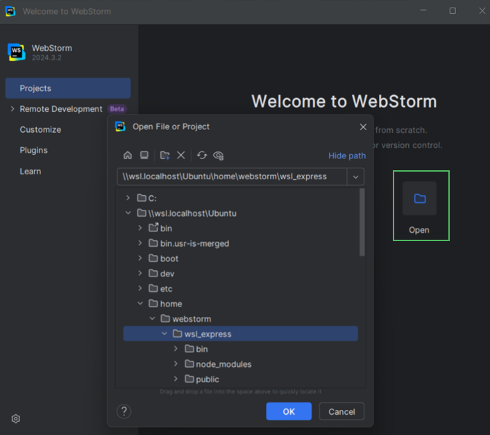

> O PhpStorm oferece suporte ao Git do *Windows Subsystem for Linux 2* (WSL2), que está disponível no Windows 10 versão 2004 .
>
> Se o Git não estiver instalado no Windows, o PhpStorm procura pelo Git no WSL e o usa de lá. Além disso, o PhpStorm alterna automaticamente do WSL para o Git para projetos que são abertos quando você usa o caminho **\\\wsl$**.
>
> Para mais informações sobre como trabalhar com Git no PhpStorm, consulte <a href="https://www.jetbrains.com/help/phpstorm/using-git-integration.html" target="_blank">Git</a>.

### Acessando WSL.localhost

O **Explorer do Windows** tem uma integração com o WSL 2 que permite acessar facilmente os arquivos do Linux diretamente do Windows. Para acessar, basta digitar `\\wsl$` na barra de endereços do Explorer.

#### Erro ao acessar a árvore do Linux via Windows Explorer

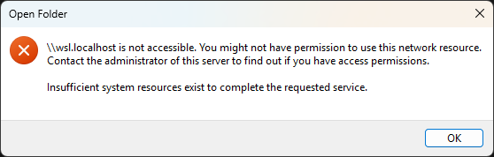

Se aparecer a janela de erro acima ao tentar abrir a arvore Linux no Windows Explorer, 
será preciso ajustar a ordem dos provedores de rede no **Registro do Windows (Registry Editor)**.

> **Atenção**: Antes de fazer qualquer alteração no registro do Windows, é altamente recomendado criar um ponto de restauração do sistema.

Precisamos priorizar o `P9NP` acima do `cbfs6` (ou `cbfsconnect2017`).

1. Pressione `Win + R`, digite `regedit` e pressione **Enter**. 
2. Navegue até a chave `HKEY_LOCAL_MACHINE\SYSTEM\CurrentControlSet\Control\NetworkProvider\Order`.
3. Clique duas vezes na entrada `ProviderOrder` e você verá uma lista separada por vírgulas. 
4. Mova `P9NP` para o início. Exemplo: `P9NP,RDPNP,LanmanWorkstation,WebClient`.
5. Agora, navegue até `HKEY_LOCAL_MACHINE\SYSTEM\CurrentControlSet\Control\NetworkProvider\ProviderOrder`.
6. Por padrão, o `P9NP` tem um valor decimal de `500`. Precisamos defini-lo como `250` e, portanto, alterar o `cbfs*` para `500`.

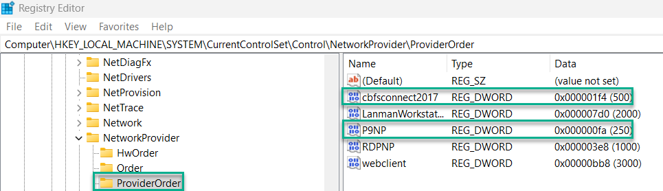

7. Feche o editor e reinicie o computador.

> O Plan 9 network provider (P9NP) é  um provedor de rede que permite o compartilhamento de arquivos entre WSL (Linux) e Windows de forma integrada.
> É essencial para comunicação de arquivos entre o Windows e o WSL por caminhos como `\\wsl$\Ubuntu\`.

# Docker

## Vantagens & Desvantagens

O Docker é ideal para desenvolvimento, CI/CD e implantação em escala por ser mais eficiente que VMS, ambientes em nuvem e locais nativos.

Vantagens:

1. **Leveza**: Containers compartilham o kernel do sistema operacional, consumindo menos recurso comparado a uma VM que precisa de um sistema operacional completo.
2. **Velocidade**: Inicializam em segundos, enquanto VMs e Clouds podem levar minutos.
3. **Portabilidade**: Os containers funcionam da mesma forma em qualquer ambiente que suporte Docker.
4. **Gerenciamento Simples**: Menor overhead para criar, destruir ou replicar ambientes.
5. **Melhor Utilização de Recursos**: Mais containers podem rodar no mesmo host, otimizando ‘hardware’ se comparados com outras opções.

Desvantagens:

1. Desempenho: Containers podem ter overhead em comparação a processos nativos.
2. Compatibilidade: Nem todos os aplicativos ou serviços suportam execução em containers.
3. Segurança: Não indicado para ambiente production. Menos isolamento que VMs, pois compartilham o kernel do host.
4. Curva de aprendizado: Configurar e gerenciar containers pode ser complexo para iniciantes.

## Dicas & Truques

### Otimizar recursos do Docker Desktop

Existe um recurso no Docker Desktop chamado **Resource Save Mode** que otimiza o uso de recursos da máquina. Ele diminui o uso de memória RAM e CPU quando o Docker Desktop não está sendo usado.

De tempos em tempos, o Docker Desktop vai analisar se há containers rodando e se não houver, ele vai diminuir o uso de recursos da máquina.

Ative-o, clicando no ícone de engrenagem no canto superior direito, vá em `Resources` &rarr; `Advanced` e habilite a opção `Resource Save Mode`, conforme a imagem abaixo:

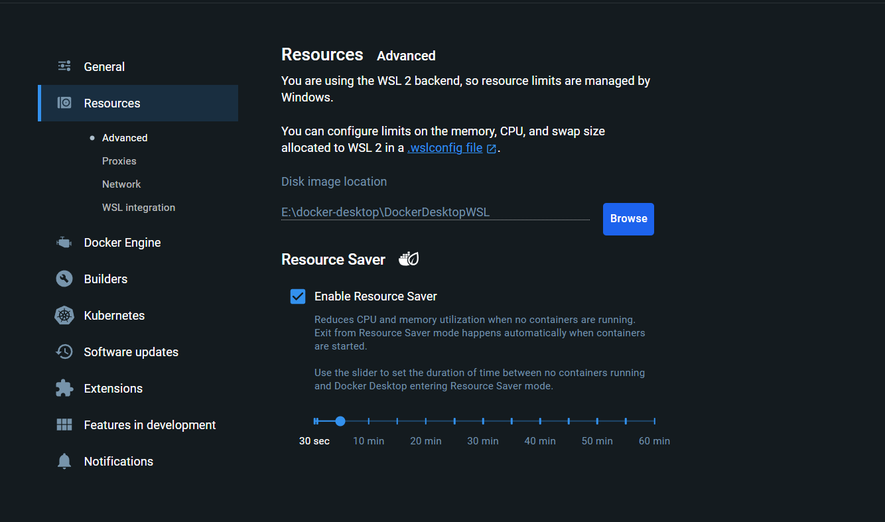

Você pode escolher de quanto em quanto tempo o Docker Desktop vai analisar se há containers rodando e diminuir o uso de recursos da máquina. O padrão é 5 min.

# ZSH

O ZSH (Z Shell) é um shell poderoso e personalizável para sistemas UNIX, como Linux e macOS. Ele é uma alternativa ao Bash (Bourne Again Shell), oferecendo recursos avançados que tornam o uso do terminal mais eficiente e produtivo.

## Vantagens do ZSH sobre o Bash:

- **Autocompletar Inteligente**: Sugestões automáticas para comandos e opções.
- **Temas e Plugins**: Personalize a aparência do terminal e adicione funcionalidades extras facilmente.
- **Correção de Comandos**: Identifica e corrige erros de digitação em comandos.
- **Histórico Aprimorado**: Pesquisa rápida e eficiente no histórico de comandos.
- **Glob Patterns Avançados**: Melhor manipulação de arquivos e diretórios.

Combinado com ferramentas como **Oh My Zsh**, o ZSH proporciona uma experiência mais moderna e produtiva no terminal.

## Instale o ZSH

Use o **gerenciador de pacotes apt** para instalar o **ZSH** no **Ubuntu**.

```bash
sudo apt install zsh
```

> O apt instalará a versão mais recente do **ZSH**. Para ver digite: `zsh --version`

Instalar o **ZSH** não irá modificá-lo e defini-lo como o shell padrão. Temos que modificar as configurações para tornar o ZSH nosso shell padrão.
Use o comando `chsh` com flag `-s` para alternar o shell padrão para o usuário.

```bash
echo $SHELL
chsh -s $(which zsh) 
# ou chsh -s /usr/bin/zsh
grep zsh /etc/passwd
```
 
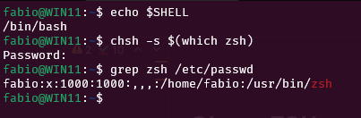

Agora, saia do terminal e faça login novamente.

### Configurando o ZSH no Ubuntu Linux

Comparado a outros shells como BASH, o ZSH requer alguma configuração inicial para ser mantido. Quando você inicia o ZSH **pela primeira vez**, ele lhe dará algumas opções para configurar.

Selecionando a opção "**1**" na primeira página, nos levará ao menu principal para configurar manualmente cada opção.
Podemos escolher a opção "**2**" que preencherá o arquivo `.zshrc` com a configuração padrão. Podemos alterar os parâmetros diretamente no arquivo `.zshrc`.

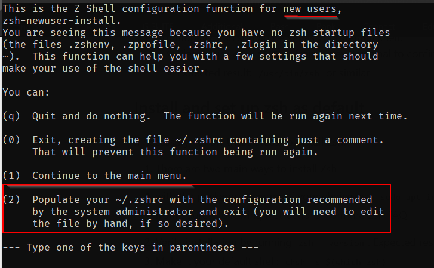

### Reverter para o antigo Bash Shell

Execute:

```bash
sudo apt --purge remove zsh 
chsh -s $(which "SHELL NAME")
```

Agora abra uma nova sessão para ver que alterações serão efetivadas.

# Oh My ZSH

<a href="https://ohmyz.sh/" target="_blank">**OH-MY-ZSH**</a> é um framework de código aberto para gerir a configuração do ZSH sendo conduzido pela comunidade. Ele vem com toneladas de funções úteis, plugins, ajudantes, temas e algumas coisas que o tornarão melhor no terminal. Atualmente, há mais de 275 plugins e 150 temas suportados.

### Requisitos
- O Zsh deve ser instalado (v4.3.9 ou mais recente serviria, mas preferimos 5.0.8 e mais recentes).
- Curl ou Wget devem ser instalados.
- O Git deve ser instalado (recomenda-se v2.4.11 ou superior).

## Instalação OH-MY-ZSH

```bash
sudo apt instalar curl wget git
```

Em seguida, <a href="https://ohmyz.sh/#install" target="_blank">instale o **Oh My Zsh** via linha de comando com **curl** ou **wget**</a>.

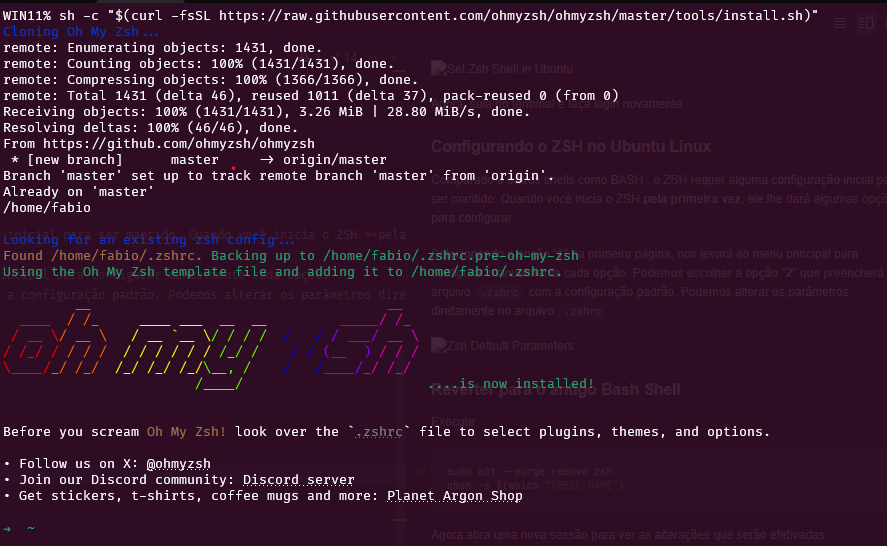

Depois que você instalar o **OH-MY-ZSH**, ele fará um backup do seu arquivo `.zhrc` existente.
Então, um novo `.zshrc` será criado com as configurações. Então, sempre que você decidir remover o **OH-MY-ZSH** usando o desinstalador, o arquivo `.zshrc` será revertido automaticamente.

> Todas as configurações são colocadas no arquivo `.zshrc`. É aqui que você vai alterar os parâmetros ou habilitar novos plugins, ou alterar temas com base nas necessidades.

## Temas OH-MY-ZSH

Os temas melhoram visualmente a aparência e o comportamento do terminal. Os temas são instalados em "`~/.oh-my-zsh/themes/`".

```bash
ls -la ~/.oh-my-zsh/themes/
```

Para que as alterações tenham efeito, execute:

```bash
source ~/.zshrc
```

## Plugins OH-MY-ZSH

Há toneladas de plugins que são suportados pelo **OH-MY-ZSH**. Configurar um plugin é bem fácil.
Tudo o que você precisa fazer é obter o pacote do plugin e adicionar o nome do plugin no parâmetro plugins no arquivo `.zshrc`.
Por padrão, o **git** é o único plugin que é habilitado após a instalação.

Adicione dois plugins `ZSH-autosuggestions` e `ZSH-Syntax-highlighting` clonando os pacotes.

```bash
git clone https://github.com/zsh-users/zsh-autosuggestions.git $ZSH_CUSTOM/plugins/zsh-autosuggestions
git clone https://github.com/zsh-users/zsh-syntax-highlighting.git $ZSH_CUSTOM/plugins/zsh-syntax-highlighting
```

Para tornar os plugins eficazes, editar o arquivo `.zhsrc` e adicione os nomes dos plugins em `plugins=()` com um espaço entre cada nome.

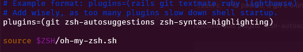

```text
plugins=(git zsh-autosuggestions zsh-syntax-highlighting)
```

Crie o arquivo source (`source ~/.zshrc`) para que as alterações sejam efetivas. 
Agora você pode ver na captura de tela que o recurso de autossugestão está habilitado e ele lembra o comando que usei anteriormente e sugere com base nele.

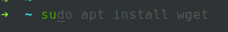

## Atualização automática

O **OH-MY-ZSH** verifica automaticamente se há atualizações quinzenalmente. Para desativá-lo, defina o parâmetro `DISABLE_AUTO_UPDATE=true`.
Você também pode controlar o número de dias em que a atualização deve ser executada definindo `export UPDATE_ZSH_DAYS=<NUMBER OF DAYS>`.

## Removendo do Ubuntu Linux

Execute o comando:

```bash
uninstall oh_my_zsh
```

Ele removerá todos os arquivos e pastas necessários que fazem parte do **OH-MY-ZSH** e reverterá para o estado anterior. **Reinicie o seu terminal para que as alterações sejam efetivadas**.

# NVM

### O que é o NVM?

O **NVM (Node Version Manager)** é uma ferramenta que permite gerir múltiplas versões do Node.js no mesmo ambiente. Com ele, é possível instalar, alternar e utilizar diferentes versões do Node.js de forma simples e eficiente, garantindo compatibilidade com projetos que dependem de versões específicas.
Isso é especialmente útil para desenvolvedores que trabalham com aplicações variadas em diferentes ambientes.

### Instalação do NVM

> 🍀 É recomendado desinstalar qualquer versão do Node.js presente na sua máquina antes de instalar o NVM para evitar colisões.

Para instalar o NVM basta usar o curl ou Wget. Execute no terminal:

```bash
$ curl -o- https://raw.githubusercontent.com/nvm-sh/nvm/v0.34.0/install.sh | bash
# ou
$ wget -qO- https://raw.githubusercontent.com/nvm-sh/nvm/v0.34.0/install.sh | bash
```

Isso vai executar um script que vai clonar o repositório do NVM e jogar num diretório chamado `~/.nvm`, que é onde serão instaladas as várias versões do Node.js que quisermos.

> 🍀 Após instalar, pode ser necessário reiniciar o seu terminal.

Depois da instalação, você precisa garantir que o `nvm` seja carregado automaticamente ao iniciar uma nova sessão. 

Adicione as linhas abaixo ao final do seu arquivo `~/.bashrc` ou `~/.zshrc`, dependendo do shell que você usa:

```bash
# loading NVM
export NVM_DIR="$([ -z "${XDG_CONFIG_HOME-}" ] && printf %s "${HOME}/.nvm" || printf %s "${XDG_CONFIG_HOME}/nvm")"
[ -s "$NVM_DIR/nvm.sh" ] && \. "$NVM_DIR/nvm.sh"
[ -s "$NVM_DIR/bash_completion" ] && \. "$NVM_DIR/bash_completion"  # This loads nvm bash_completion
```
Após editar, aplique as mudanças com 

```bash
source ~/.bashrc
```
ou 
```bash
source ~/.zshrc
```


### Comandos Básicos

Os comandos são bem simples.

Para ver que versões estão instaladas na sua máquina:

| Comando       | Descrição                                  |
|:--------------|:-------------------------------------------|
| ```nvm ls```  | Listar versões instaladas                  |
| ```nvm ls-remote```  | Listar versões disponíveis para instalaçáo |
| ```nvm install vX.X.X```  | Instalar uma versão                        |
| ```nvm uninstall vX.X.X```  | Desinstalar uma versão                     |
| ```nvm use vX.X.X```  | Usar uma versão do Node.js                 |
| ```nvm use node```  | Usar a versão mais recente do Node.js      |
| ```nvm alias meunome vX.X.X```  | Definir nome para uma versão               |
| ```nvm use meunome```  | Usar versão pelo nome definido             |
| ```nvm unalias meunome```  | Remover um nome de versão                  |
| ```nvm alias default vX.X.X```  | Definir uma versão padrão                  |
| ```nvm alias default node```  | Definir versão mais recente como padrão    |
| ```nvm  current```  | Indicação da versão atual                  |

Com o `nvm` carregado, o comando abaixo instalará a versão mais recente do **Node.js** e o **npm** correspondete:

```bash
nvm install node
```

### Migração de pacotes globais

Quando você altera a versão do Node.js em uso, a versão do NPM também muda. Isso significa que os pacotes instalados globalmente numa versão não estarão disponíveis ao utilizar outra.
Para evitar o trabalho de reinstalar cada pacote global ao mudar de versão do Node.js, você pode usar a opção `--reinstall-packages-from`.

Por exemplo, ao instalar a **versão 6** do Node.js, você pode usar esse comando para transferir automaticamente os pacotes globais instalados na **versão 5**, simplificando a transição entre versões.

```bash
nvm install 6 --reinstall-packages-from=5
```

Como mencionado, `node` é um atalho para indicar a versão mais recente. Caso queira instalar a versão mais recente disponível e já migrar os pacotes globais da versão mais recente que está instalada na sua máquina, basta executar:

```bash
nvm install node --reinstall-packages-from=node
```

> Execute o nvm dentro do WSL. No momento esta funcionalidade ainda não está disponível para o nvm-windows, sendo necessária a instalação manual dos pacotes globais sempre que instalar uma nova versão do Node.js.

### Definição de versão por projeto

O objetivo de usar o **NVM** é gerir diferentes versões do Node.js para cada projeto. No entanto, pode ser difícil lembrar qual versão foi usada em cada um.
Para resolver isso, basta criar um arquivo chamado `.nvmrc` na raiz do projeto e inserir a versão do Node.js usada nesse projeto. Por exemplo:

```text
v12.4.0
```

Assim, ao abrir o terminal dentro do projeto e executar o comando `nvm use`, o NVM localizará automaticamente o arquivo `.nvmrc` e utilizará a versão indicada, garantindo consistência no ambiente.

# Fontes

- <a href="https://ohmyz.sh/" target="_blank">Site Oh My Zsh</a>
- <a href="https://www.tecmint.com/install-oh-my-zsh-in-ubuntu/" target="_blank">Como instalar o OH-MY-ZSH no Ubuntu 20.04</a>
- <a href="https://github.com/nvm-sh" target="_blank">Projeto NVM no GitHub</a>
