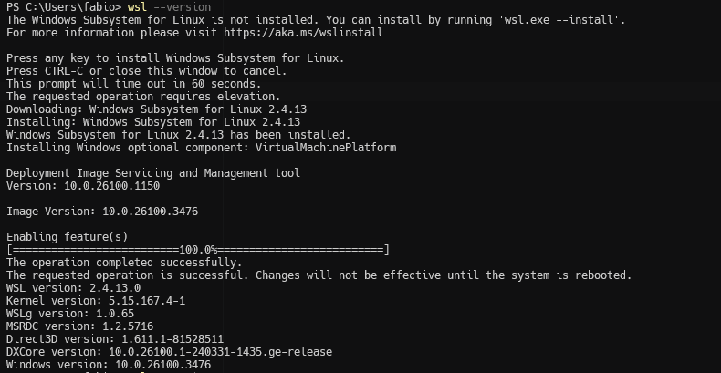
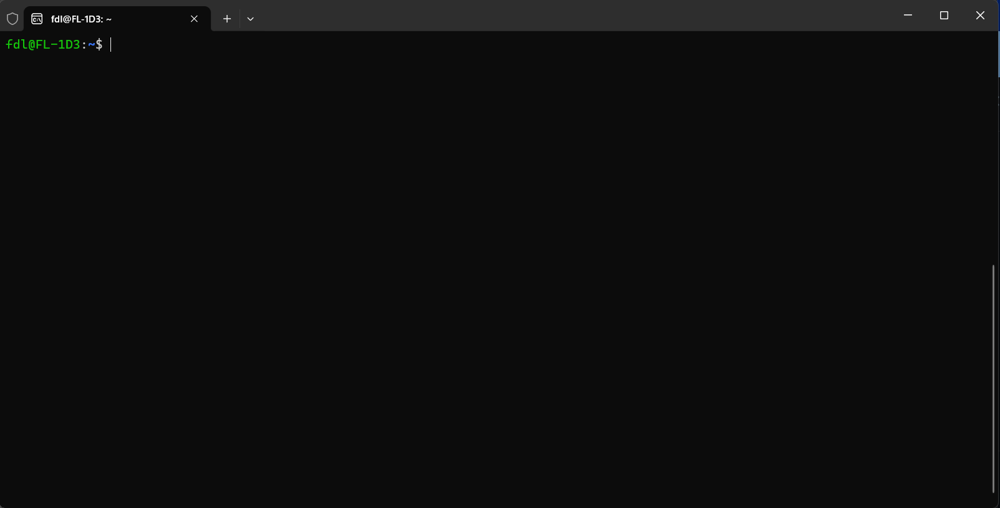
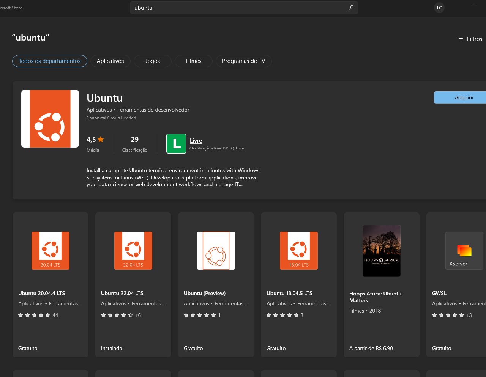
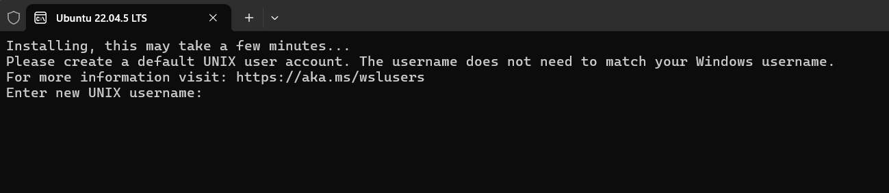
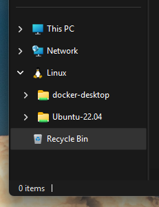
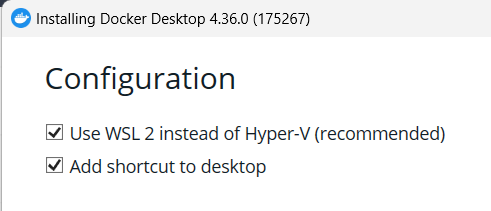
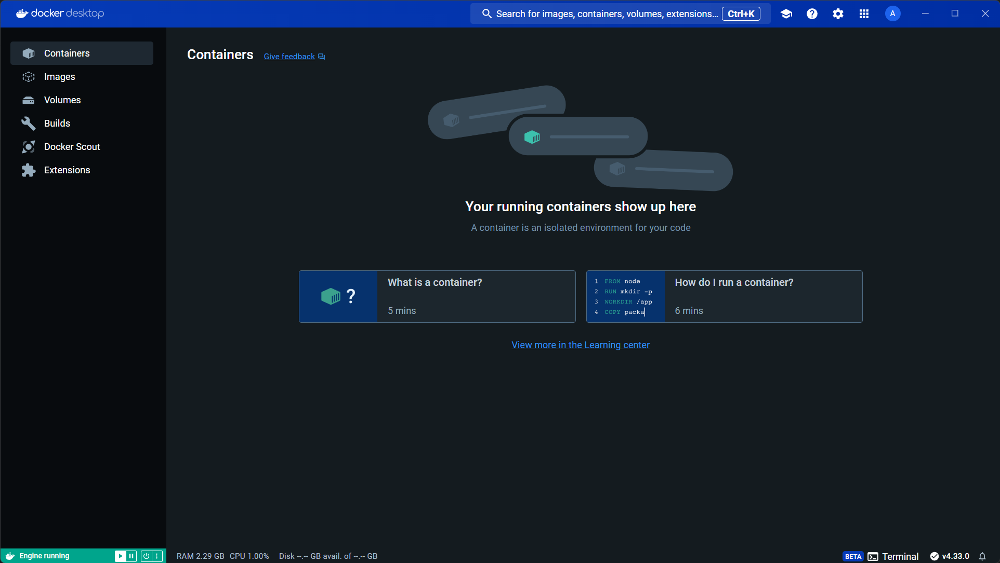
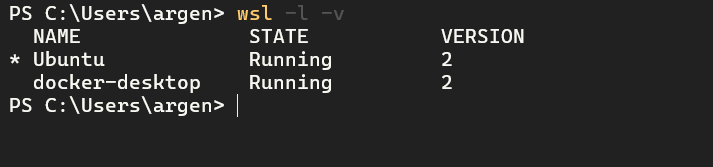
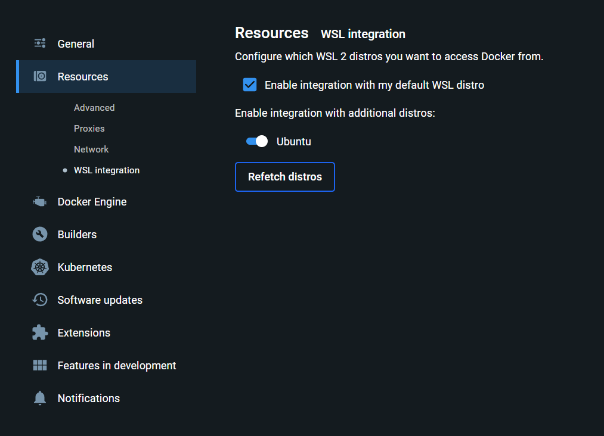

<p align="center">
  <a href="https://fabricadolivro.com.br/" target="blank"></a>
</p>

# Guia de Ambiente de Trabalho

<details open>
  <summary>
    <strong>WSL</strong>
  </summary>

- [O que é WSL 2?](#o-que-é-wsl-2)
- [Requisitos mínimos](#requisitos-mínimos)
- [Instalação do WSL 2 (Windows 10/11)](#instalação-do-wsl-2-windows-1011)
    - [Windows Update](#windows-update)
    - [Terminal do Windows](#terminal-do-windows)
    - [Instale o Ubuntu](#instale-o-ubuntu)
    - [Conhecendo e Configurando o WSL](#conhecendo-e-configurando-o-wsl)
    - [Integrações com IDEs (optional)](#integrações-com-ides-opcional)
</details>

<details open>
  <summary>
    <strong>Docker</strong>
  </summary>

- [O que é o Docker](#o-que-é-docker)
    - [Vantagens & Desvantagens](#vantagens--desvantagens)
- [Docker no Windows](#docker-no-windows)
- [Instalação do Docker Desktop (com WSL 2)](#instalação-do-docker-desktop-com-wsl-2)
     - [Ativar o Docker na distribuição Linux](#ativar-o-docker-na-distribuição-linux)
     - [Otimizar recursos do Docker Desktop](#otimizar-recursos-do-docker-desktop)
     - [Aplicar autoMemoryReclaim no WSL 2](#aplicar-automemoryreclaim-no-wsl-2)
</details>

<details>
  <summary>
    <strong>Ambiente de Desenvolvimento

</strong>
  </summary>
  
- [Limitar recursos usados pelo WSL 2](#limitar-recursos-usados-pelo-wsl-2)
- [Systemd](#systemd)
- [O que é WSLg](#o-que-é-wslg)
</details>

# WSL 2

## O que é WSL 2

O WSL 2 ou ***Windows Subsystem for Linux***, é uma camada de compatibilidade que permite executar distribuições Linux
nativamente no Windows, utilizando uma arquitetura baseada em um kernel completo Linux completo integrado ao sistema.\

Veja [Requisitos mínimos do WSL 2](Extras.md#requisitos-mínimos-do-wsl-2) nos Extras.

### Terminal do Windows

Use o **Windows Terminal** para desenvolver no Windows e também para acessar o WSL 2. Instale-o pelo **Windows Store**.

> [!IMPORTANT]
> ️ Esta documentação faz o uso do
> <a href="https://docs.microsoft.com/pt-br/windows/terminal/get-started/" target="_blank">Windows Terminal</a> como
> terminal padrão para desenvolvimento no Windows.

Por padrão, o Windows Terminal identificará e agregará o shell do Ubuntu (que iremos instalar a seguir) e os
principais shells instalados no Windows, como PowerShell, CMD e WSL numa única janela, além de permitir personalização
de cores, temas, atalhos e muito mais. Veja 
<a href="https://docs.microsoft.com/pt-br/windows/terminal/get-started/" target="_blank">Mais sobre o Windows Terminal ↗️</a>.

## Instalação do WSL 2 (Windows 10/11)

### Windows Update

É essencial manter o Windows atualizado, pois o **WSL 2 depende de uma versão atualizada do Hyper-V**. Verifique o 
`Windows Update`. Com a versão 2004 do Windows 10 ou Windows 11 Pro, o <span style="color: #ffff00">WSL já estará
presente na sua máquina</span>, execute o comando para ver a versão do WSL:

```bash
wsl --version
```

Se o WSL 2 não estiver instalado, será exibida a opção para instalá-lo. Pressione qualquer tecla, aguarde a 
conclusão da instalação e reinicie o sistema.
 


> A versão 2 normalmente é a default, mas a versão 1 do WSL pode estar como default, execute o comando abaixo para 
> definir como default a versão 2:
>
> ```bash
> wsl --set-default-version 2
> ```

## Instale o Ubuntu

Existem duas maneiras de instalar: pelos **comandos do WSL** ou pela **Windows Store**. Independente do meio, 
considere instalar o Ubuntu (sem versão) pois essa distribuição já vem com diversas ferramentas úteis para
desenvolvimento pré-instaladas.

### Opção 1 - Instalação via comandos

#### 1.1. Execute o comando a seguir para instalar o `Ubuntu` (sem versão) como o Linux padrão:

```bash
wsl --install
```

Se você quiser instalar uma versão diferente do Ubuntu, execute o comando `wsl -l -o` para listar as distribuições 
disponíveis. Instale a versão escolhida com o comando `wsl --install -d [nome-da-distribuicao]`.

#### 1.2. Você deverá criar um **nome de usuário** e uma **senha**.

O nome de usuário não pode conter espaços ou caracteres especiais. Você pode usar letras, números e o caractere `-`
(hífen). A senha deve ser forte, com pelo menos 8 caracteres, incluindo letras maiúsculas, minúsculas, números e
caracteres especiais. Esta senha será usada para instalar pacotes e realizar operações de superusuário.

#### 1.3. Com êxito na operação, pode ser necessário **reiniciar o sistema para que as alterações entrem em vigor**.

#### 1.4. Para abrir uma nova janela do Ubuntu, basta digitar `Ubuntu` no menu Iniciar e clicar no ícone do Ubuntu.

> [!NOTE]
> O Ubuntu não estará imediatamente disponível no Windows Terminal. Inicie uma nova sessão do Terminal.



### Opção 2 - Instalação via Windows Store

#### 2.1. Basta acessar o Windows Store e procurar pelo nome da distribuição Linux desejada e clicar em instalar.



#### 2.2. após a instalação, clique em "Abrir" para acessar o terminal e criar a conta de usuário UNIX padrão.



> *Parabêns, o seu WSL 2 já está funcionando!*

### Conhecendo e Configurando o WSL

Nesse ponto, o WSL 2 está instalado com uma distribuição Ubuntu instalada, teste no terminal:

```bash
wsl -l -v
```

> [!TIP]
> Para mais detalhes leia [Configurações do WSL](Extras.md#configurações-do-wsl) nos **Extras**.

### WSL 2 no Windows Explorer

Depois de instalar o WSL 2 e instalar algumas VMs Linux, as árvores de arquivos das VMs estarão disponíveis no Windows 
em `\\wsl$` e o Windows Explorer começa a exibir uma árvore Linux:



> [!TIP]
> Caso não esteja acessível à árvore Linux, veja [Acessando WSL.localhost](Extras.md#acessando-wsllocalhost) nos
> **Extras**.

### Integrar WSL com IDEs (Recomendado)

Verifique nos **Extras** como integrar o WSL 2 com as IDEs:

- [Integração com o Visual Studio Code (VSCode)](Extras.md#integração-com-vscode)
- [Integração com o PhpStorm (PS)](Extras.md#integração-com-phpstorm)

# Docker 

## O que é o Docker

O Docker é uma plataforma 'open source' de containers que permite empacotar aplicativos e as suas dependências num 
ambiente isolado e portátil.

> Veja [Vantagens & Desvantagens](Extras.md#vantagens--desvantagens) do Docker nos Extras.

## Docker no Windows

Há ao menos 4 modos de usar o Docker no Windows, no entanto, iremos optar pelo **Docker Desktop com WSL 2**.

> - **Docker Toolbox** - o desempenho do Toolbox pode ser muito ruim. Recomendado para versões antigas do Windows (Xp, 
Vista, 7, 8 e 8.1);
> - **Docker Desktop com Hyper-V** - Necessita da versão **PRO** do Windows 10/11, portanto é necessário comprá-la.
> - **Docker Engine** (Docker Nativo) - diretamente instalado no WSL 2 é viável, todavia a manutenção e segurança pode 
ser um desafiante para usuários iniciantes.

Docker Desktop com WSL 2 tem um grande desempenho e consome menos recursos quando comparado ao Docker Toolbox ou Docker 
Desktop com Hyper-V.

## Instalação do Docker Desktop (com WSL 2)

Baixe neste link: <a href="https://www.docker.com/products/docker-desktop/" target="_blank">https://www.docker.com/products/docker-desktop/ ↗️</a> e instale o Docker Desktop.

> 🍀 Se ao executar o instalador aparecer uma janela com erro `Erro - Este Aplicativo Não Pode ser executado em seu 
> computador`, provavelmente você baixou uma versão incompativel com o seu pc.
> 
> No Windows, verifique a arquitetura do sistema acessando **Configurações** &rarr; **Sistema** &rarr; **Sobre**: 
> - 64-bit Operating System, x64-based processor &rarr; Docker AMD64.
> - 64-bit Operating System, ARM-based processor &rarr; Docker ARM64.

<span style="color:#ffffff;background-color:saddlebrown;width:100%;display:block;padding:.8rem 1rem">
⚠️ Importante - Durante a instalação mantenha a opção de suar o WSL 2 habilitada:
</span>



Logo após a instalação, será pedido para conectar com a sua conta do Docker. Faça o login (crie uma conta se não tiver) 
e siga as instruções.

Ao final da instalação, o ‘Docker Desktop’ estará instalado e rodando. Você pode ver o ícone do Docker perto do relógio
do Windows. Ele ficará a rodar em segundo plano. A interface do Docker Desktop deverá ficar assim:



Podemos ver agora que há duas distribuições Linux rodando no WSL 2, uma é a distribuição padrão do Ubuntu (ou a que você
instalou) e a outra é a distribuição do Docker Desktop:

```bash
wsl -l -v
```



### Ativar o Docker na distribuição Linux

Para o Docker funcionar na sua distribuição Linux, você precisa ativá-lo no painel do `Docker Desktop`. Abra a 
`interface` do `Docker Desktop`, clique no ícone de engrenagem no canto superior direito, vá em `Resources` | 
`WSL Integration` e habilite a distribuição Linux que você deseja usar o Docker, e clique em `Apply & Restart`, conforme
a imagem abaixo:



### Configuranndo o Docker Desktop

- Veja [Otimizar recursos do Docker Desktop](Extras.md#otimizar-recursos-do-docker-desktop) nos Extras (Recomendado).
- Veja [Aplicar autoMemoryReclaim no WSL 2](Extras.md#aplicar-automemoryreclaim-no-wsl-2) nos Extras (Recomendado).

# Shell do Ubuntu

<span style="color:#ffffff;background-color:saddlebrown;width:100%;display:block;padding:.8rem 1rem">
⚠️ A partir deste ponto, todos os comandos deverão ser executados no terminal do <b>Ubuntu</b>.
</span>

Novamente, para acessar o shell da distribuição Ubuntu que instalou, abrar um nova aba do Terminal do Windows
(recomendado) ou digite `wsl` no PowerShell.

> Para uma experiência de shell mais moderna e eficiente, use o *framework* **Oh My Zsh**. Consulte o arquivo 
> [Extras.md](Extras.md#oh-my-zsh) para instruções de instalação.

> 🍀 Caso tenha **instalado alguma distribuição Ubuntu diferente da padrão do WSL 2**, algumas ferramentas podem estar 
> faltando, instale-as agora:
>
>```bash
>sudo apt update &&
>sudo apt install make curl wget git zip unzip vim unrar-free tar gzip bzip2 xz-utils p7zip-full p7zip-rar -y
>```

# Git & GitHub

**Git** é um sistema de controle de versão distribuído que permite rastrear alterações no código, colaborar com outros 
desenvolvedores e reverter mudanças, garantindo histórico e organização no desenvolvimento de software.

já o **GitHub** é uma plataforma baseada na nuvem que hospeda repositórios Git, adicionando ferramentas para 
colaboração, gestão de projetos, revisão de código e integração com outros serviços.

> Git é a ferramenta de controle de versões de código; GitHub é o serviço que facilita o uso do Git em equipe.

A distribuição Ubuntu padrão do WSL 2 já vem com git. Você deve conseguir verificar a versão instalada executando:

```bash
git -v
```

### Conta no GitHub

Se você ainda não possui uma conta pessoal no GitHub, interrompa a leitura deste guia e crie a sua conta no 
<a href="https://github.com/" target="_blank">site oficial do GitHub ↗️</a>.

### Configuração global

Para configurar um usuário global no Git, execute:

```bash
git config --global user.name "Seu Nome ou username"
git config --global user.email "seuemaildogithub@exemplo.com"
```

> Utilize o seu `username` e `email` do GitHub como seu `name` e `email` globais.

Para verificar se os valores foram definidos corretamente:

```bash
git config --global --list
```

> Mais detalhes no artigo 
> <a href="https://docs.github.com/pt/get-started/git-basics/setting-your-username-in-git" target="_blank">Definir seu
> nome de usuário no Git ↗️</a> no GitHub.

### Comunicação entre Git e GitHub com SSH

O Git e o GitHub podem se comunicar de forma segura usando chaves SSH. Isso elimina a necessidade de inserir credenciais 
repetidamente (via HTTPS), automatizando e protegendo a autenticação.

Como Funciona:

- Chave SSH Privada e pública:
  - A chave privada permanece no computador e é usada para autenticar conexões.
  - A chave pública é adicionada à conta do GitHub e valida a chave privada.
- Configuração do GitHub:
  - Com a chave pública cadastrada no GitHub, comandos Git (`git push`/`git pull`) são autorizados automaticamente.

## Criando e Configurando Chaves SSH no GitHub (Linux)

### 1. Gere uma chave SSH local:

```bash
cd ~ 
ssh-keygen -t rsa -b 4096 -C "seuemaildogithub@example.com"
```

Quando for solicitado a inserir um arquivo para salvar a chave, pressione `Enter` para aceitar o local padrão do arquivo
(`~/.ssh`). 

```bash
> Enter a file in which to save the key (/home/YOU/.ssh/id_ALGORITHM):[Press enter]
```

> 🍀 Observe que, se você criou chaves SSH anteriormente, ssh-keygen pode pedir que você reescreva outra chave. Nesse 
> caso, recomendamos criar uma chave SSH personalizada. Para fazer isso, digite o local do arquivo padrão e substitua 
> id_ALGORITHM pelo nome da chave personalizada.

Em seguida, digite (e confirme) uma frase secreta segura. Para saber mais, confira
<a href="https://docs.github.com/pt/enterprise-server@3.10/authentication/connecting-to-github-with-ssh/working-with-ssh-key-passphrases" target="_blank">
Trabalhar com frase secreta da chave SSH ↗️</a>.

```bash
> Enter passphrase (empty for no passphrase): [Type a passphrase]
> Enter same passphrase again: [Type passphrase again]
```

### 2. Adicione a chave SSH ao ssh-agent

Inicie o ssh-agent em segundo plano.

```bash
eval "$(ssh-agent -s)"
# Agent pid 2245
```

Adicione sua chave SSH privada ao ssh-agent.

```bash
ssh-add ~/.ssh/id_rsa
```

### 3. Adicione a chave SSH pública é sua conta do GitHub

#### 3.1. Copie a chave pública SSH para a sua área de transferência.

```bash
clip.exe < ~/.ssh/id_rsa.pub
# Copia o conteúdo do arquivo id_rsa.pub para o clipboard
```

> 🍀 Em versões mais recentes do Windows que usam o Windows Terminal ou em qualquer outro lugar que use a linha de comando do PowerShell, você poderá receber um ParseError indicando que The '&lt;' operator is reserved for future use.. Nesse caso, o seguinte comando alternativo clip deve ser usado: `cat ~/.ssh/id_ed25519.pub | clip`

#### 3.2. Adicione a chave copiada o GitHub.

- No canto superior direito de qualquer página do GitHub, clique sua foto de perfil e, em seguida, clique em **?? Configurações** (`Settings`).
- Na seção "Acesso" da barra lateral, clique em **? Chaves SSH e GPG** (`SSH and GPG keys`).
- Clique em **Nova chave SSH** (`New SSH Key`) ou **Adicionar chave SSH**.
- No campo "Título" (`Title`), adicione uma etiqueta descritiva para a nova chave. Por exemplo, se estiver usando um laptop pessoal, você poderá chamar essa chave de "Notebook do trabalho".
- Selecione o tipo de chave (`Key type`) "**autenticação**". Para saber mais sobre a "assinatura" de commit, confira <a href="https://docs.github.com/pt/enterprise-server@3.10/authentication/managing-commit-signature-verification/about-commit-signature-verification" target="_blank">Sobre a verificação de assinatura de commit</a>.
- No campo "Chave" (`Key`), cole sua chave pública.
- Clique em **Adicionar chave SSH** (`Add SSH Key`).

> 🍀 Se solicitado, faça a autenticação de dois fatores (2FA) para finalizar a adição.

#### 3.3. Teste a chave SSH configurada no GitHub

Tentar autenticar sua chave SSH com o servidor do GitHub executando o comando:

```bash
ssh -T git@github.com
```

> 🍀 Se for a primeira vez que você está se conectando a esse servidor, a chave pública dele não está armazenada no arquivo `~/.ssh/known_hosts` do seu sistema.
> Digite `yes` para continuar. Isso adicionará a chave do GitHub as redes conhecidas e não será perguntado novamente. 

Se a configuração estiver correta, você verá uma mensagem como:

```bash
Hi <username>! You've successfully authenticated, but GitHub does not provide shell access.
```

> 🍀 A chave secreta poderá não persistir no `ssh-agent` ao reiniciar o sistema/terminal, exigindo digitar a senha
> novamente toda vez que for utilizar um comando `git pull` ou `git push`. Para evitar isso, você pode adicione ao final
> do seu `~/.bashrc` ou `~/.zshrc`:
>
> ```bash
> eval "$(ssh-agent -s)"
> ssh-add ~/.ssh/id_rsa > /dev/null 2>&1
> ```
> 
> Salve e execute o comando `source ~/.bashrc` ou `source ~/.zshrc` para aplicar as alterações. Cada vez que você
> reinicializar, você terá que digitar sua frase-senha. Mas você só precisa fazer isso uma vez até reiniciar ou encerrar
> o WSL.

# Ambiente de Desenvolvimento

## Clonando os repositórios

Dentro do diretório home do usuário atual crie a pasta raiz dos repositórios. Executando:

```shell
cd ~ && mkdir fabricadolivro
```

Clone todos os repositórios para dentro da pasta raiz. Faça isso executando:

```shell
cd ~/fabricadolivro
git clone git@github.com:fabricadolivro/docker.git
#git clone git@github.com:fabricadolivro/administrative.git
#git clone git@github.com:fabricadolivro/admin-backend.git
#git clone git@github.com:fabricadolivro/admin-frontend.git
git clone git@github.com:fabricadolivro/ecommerce-backend.git
git clone git@github.com:fabricadolivro/ecommerce-frontend.git
git clone git@github.com:fabricadolivro/editor-backend-api.git
git clone git@github.com:fabricadolivro/editor-frontend.git
```

> 🍀 Para clonar um repositório com SSH, é necessário configurar uma chave e publicá-la no seu perfil do github. <a href="https://docs.github.com/pt/authentication/connecting-to-github-with-ssh/generating-a-new-ssh-key-and-adding-it-to-the-ssh-agent" target="_blank">Saiba mais aqui</a>.

## Configurando os Hosts no Windows

Edite o arquivo ```hosts``` presente na pasta de configurações de rede no Windows (por padrão ```C:\Windows\System32\drivers\etc```) e adicione no final do arquivo as linhas a seguir:

```text
# Fabrico do Livro
127.0.0.1 admin-backend.fabricadolivro.lab
127.0.0.1 admin-frontend.fabricadolivro.lab
127.0.0.1 administrative.fabricadolivro.lab
127.0.0.1 ecommerce-backend.fabricadolivro.lab
127.0.0.1 ecommerce-frontend.fabricadolivro.lab
127.0.0.1 editor-backend-api.fabricadolivro.lab
127.0.0.1 editor-frontend.fabricadolivro.lab
```

## Variáveis de Ambiente (.env)

Acesse a pasta do projeto "docker" e copie o arquivo `.env.example` para `.env`:

```shell
cd ~/fabricadolivro/docker && \
cp .env.example .env
```

Insira suas  credencias de banco de dados (Development e Production) no arquivo de ambiente `.env`.

## Containers 

Utilizaremos o Make para orquestrar e gerenciar os containers Docker por meio de comandos específicos.

> O Make é uma ferramenta de automação de tarefas que permite a execução de comandos de forma mais simples e rápida. Ele
> é muito útil para automatizar tarefas repetitivas e complexas. 
  
> 🍀 Esses comandos executam instruções Docker e ações de montagem e desmontagem que estão definidos no arquivo 
> `Makefile` deste projeto. Por isso, é importante que você tenha o Docker Desktop instalado e rodando no Windows.


### Construindo as imagens Docker

No terminal, navegue até o projeto `docker` (```~/fabricadolivro/docker```), execute:

```shell
make build
# ou docker compose -f docker-compose.yml build
```

> Na primeira vez, esse processo pode levar alguns minutos a depender da velocidade de conexão.

Ao termino do processo, o docker terá baixado as imagens Docker genêricas
(node, php 7.2, php8.4, mysql 8.0, redis...) e processado as instruções para
construção das imagens customizadas para os serviços definidos; além de
configurar dependências, volumes e variáveis de ambiente. Este comando é 
essencial para preparar as imagens antes de executar os containers.

### Instalando as dependências

...

> <span style="color:#ffff00">Pronto!</span> Seu ambiente de desenvolvimento está pronto!

# Extras

Para recursos avançados verifique o arquivo [Extras.md](Extras.md): 

- **WSL2** - como limita recursos
- **Systemd** - para recursos avançados
- **WSLg** - abra apps do Ubuntu no Windows
- **Zsh** e **Oh My Zsh** - shell moderno
- **NVM** - gerenciamento de versões Node.js

<a href="https://docs.github.com/pt/enterprise-server@3.10/authentication/connecting-to-github-with-ssh/adding-a-new-ssh-key-to-your-github-account" target="_blank">Adicione a chave SSH pública é sua conta do GitHub ↗️</a>
