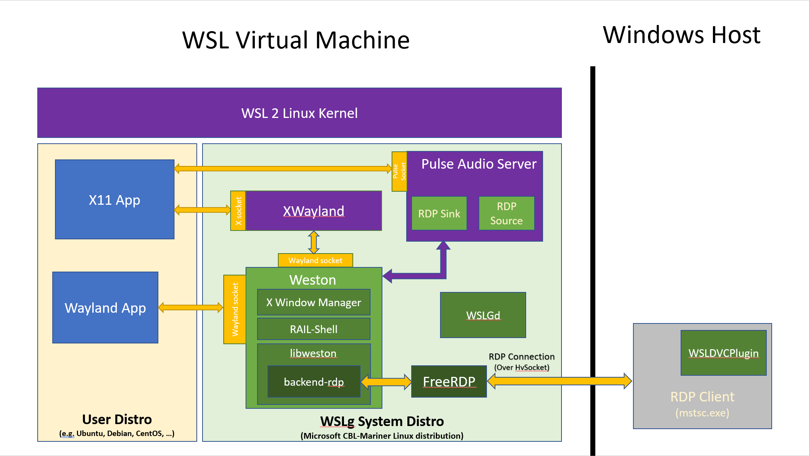

<p align="center">
  <a href="https://fabricadolivro.com.br/" target="blank"></a>
</p>

# Guia de Ambiente de Trabalho

<details>
  <summary>
    <strong>WSL</strong>
  </summary>

- [O que é?](#o-que-é)
- [Requisitos mínimos](#requisitos-mínimos)
- [Instalação do WSL 2 (Windows 10/11)](#instalação-do-wsl-2-windows-1011)
    - [Windows Update](#windows-update)
    - [Instale o Ubuntu](#instale-o-ubuntu)
- [Ferramentas](#ferramentas)
    - [Terminal do Windows](#terminal-do-windows)
    - [Integração com VSCode (opcional)](#integração-com-vscode-opcional)
</details>

<details open>
  <summary>
    <strong>Docker</strong>
  </summary>

- [O que é o Docker](#o-que-é-docker)
- [Modo de usar Docker no Windows](#modos-de-usar-docker-no-windows)
  - [1 - (Obsoleto) Docker Toolbox](#1-obsoleto-docker-toolbox)
  - [2 - (Obsoleto) Docker Desktop com Hyper-V](#2-obsoleto-docker-desktop-com-hyper-v)
  - [3 - Docker Desktop com WSL 2](#3-docker-desktop-com-wsl2)
    - [Vantagens](#docker-desktop-vantagens)
    - [Desvantagens](#docker-desktop-desvantagens)
  - [4 - Docker Engine (Docker Nativo) diretamente instalado no WSL2](#4-docker-engine-docker-nativo-diretamente-instalado-no-wsl2)
    - [Vantagens](#docker-engine-vantagens)
    - [Desvantagens](#docker-engine-desvantagens)
- [Qual modo de usar Docker no Windows escolher?](#qual-modo-de-usar-docker-no-windows-escolher)
- [Instalação do Docker](#instalação-do-docker)
  - [1 - Instalar o Docker com Docker Desktop](#1---instalar-o-docker-com-docker-desktop)
    - [Ativar o Docker na distribuição Linux](#ativar-o-docker-na-distribuição-linux)
    - [Otimizar recursos do Docker Desktop](#otimizar-recursos-do-docker-desktop)
    - [Aplicar autoMemoryReclaim no WSL 2](#aplicar-automemoryreclaim-no-wsl-2)
  - [2 - Instalar o Docker com Docker Engine (Docker Nativo)](#instalar-o-docker-com-docker-engine-docker-nativo)
    - [Erro ao iniciar o Docker no Ubuntu 22.04](#erro-ao-iniciar-o-docker-no-ubuntu-2204)
    - [Iniciar o Docker automaticamente no WSL](#iniciar-o-docker-automaticamente-no-wsl)
    - [Docker com Systemd](#docker-com-systemd)
</details>

<details>
  <summary>
    <strong>Extras</strong>
  </summary>

- [Limitar recursos usados pelo WSL 2](#limitar-recursos-usados-pelo-wsl-2)
- [Systemd](#systemd)
- [O que é WSLg](#o-que-é-wslg)
</details>

## O que é

O WSL2 ou ***Windows Subsystem for Linux***, é uma camada de compatibilidade que permite executar distribuições Linux nativamente no Windows, utilizando uma arquitetura baseada em um kernel completo Linux completo integrado ao sistema. 

Ele oferece melhor desempenho, compatibilidade total com chamadas do sistema Linux e suporte a ferramentas de desenvolvimento como Docker e Kubernetes, facilitando a criação e o uso de ambientes de desenvolvimento híbridos diretamente no Windows.

> Com WSL 2 é possível executar Docker e outras ferramentas que dependem do Kernel do Linux usando o Windows 10/11.

## Requisitos mínimos

* **Windows 10 Home ou Professional**
    - Versão 2004 ou superior (Build 19041 ou superior).
    - Versões mais antigas requerem a instalação manual do WSL 2. Ver tutorial [https://learn.microsoft.com/en-us/windows/wsl/install-manual](https://learn.microsoft.com/en-us/windows/wsl/install-manual).
* **Windows 11 Home ou Professional**
    - Versão 22000 ou superior (qualquer Windows 11).
* Uma máquina compatível com virtualização. Se sua máquina for mais antiga pode ser necessária habilita-la na BIOS).
* Pelo menos 4GB de memória RAM (Recomendado 8GB).

## Instalação do WSL 2 (Windows 10/11)

### Windows Update

É essencial manter o Windows atualizado, pois o **WSL 2 depende de uma versão atualizada do Hyper-V**. Verifique o Windows Update.
Com a versão 2004 do Windows 10 ou Windows 11, o <span style="color:#ffff00">WSL já estará presente em sua máquina</span>, execute o comando para ver a versão do WSL:

```bash
wsl --version
```

A versão 2 normalmente é a default, mas a versão 1 do WSL pode estar como default, execute o comando abaixo para definir como default a versão 2:

```bash
wsl --set-default-version 2
```

### Instale o Ubuntu

Execute o comando a seguir para instalar o `Ubuntu` (sem versão) como subsistema:

```bash
wsl --install
```

> A Ubuntu (sem versão) já vem com várias ferramentas úteis para desenvolvimento instaladas por padrão.
Se você quiser instalar uma versão diferente do Ubuntu, execute o comando `wsl -l -o` para listar as distribuições disponíveis.

> Também é possível instalar distribuições Linux pelo **Windows Store**. Basta acessar o Windows Store e procurar pelo nome da distribuição Linux desejada e clicar em instalar.

Com êxito na operação, há uma boa chance de precisar reiniciar o seu sistema para que as alterações tenham efeito.
Após, você deverá criar um **nome de usuário** que poderá ser o mesmo da sua máquina.
Crie um nome de usuário sem espaço e caracteres especiais) e uma **senha** (defina uma senha forte). Esta senha será usada para instalar pacotes e realizar operações de superusuário.

> Para abrir uma nova janela do Ubuntu, basta digitar `Ubuntu` no menu Iniciar e clicar no ícone do Ubuntu.

Parabéns, seu WSL2 já está funcionando!

## Ferramentas

### Terminal do Windows

Recomendamos o uso do [Windows Terminal](https://docs.microsoft.com/pt-br/windows/terminal/get-started) como terminal padrão para desenvolvimento no Windows.

Por padrão, ele identificará e agregará o shell do Ubuntu e os principais shells instalados no Windows, como PowerShell, CMD e WSL em uma única janela, além de permitir personalização de cores, temas, atalhos e muito mais.
A experiência de usar o Windows Terminal é muito melhor que o terminal padrão do Windows, use ele para desenvolver no Windows e também para acessar o WSL 2.

Instale-o pelo **Windows Store**. Veja mais opções de configuração dele em [Mais sobre o Windows Terminal](https://docs.microsoft.com/pt-br/windows/terminal/get-started).

### Integração com VSCode

O Visual Studio Code tem uma extensão chamada **WSL** que permite acessar o WSL 2 diretamente do VSCode. Com esta extensão, você pode editar seus arquivos diretamente no WSL 2, rodar comandos, instalar extensões e muito mais.

Veja mais sobre esta extensão em [WSL](https://marketplace.visualstudio.com/items?itemName=ms-vscode-remote.remote-wsl).

Ao abrir um projeto que está dentro do Linux, é importante que o modo WSL do VSCode esteja ativado. No canto inferior esquerdo do VSCode, clique no botão `><` e selecione `Connect to WSL`. Isto irá conectar o VSCode ao WSL 2 e então poderá abrir o projeto que está dentro do Linux. Você verá que o botão `><` mudará para `WSL: Ubuntu`.


Se o VSCode não estiver desta forma ao abrir projetos dentro do Linux, então o modo WSL não estará ativado e você perderá performance ao editar arquivos dentro do Linux, além de não ter suporte para algumas extensões.

> Com a extensão também será possível abrir o projeto no modo WSL diretamente pelo terminal. 
> Acesse a pasta do projeto no terminal do WSL e digite `code .`. Isto abrirá o VSCode no modo WSL. 
> Para que o atalho funcione, você deve iniciar uma nova seção do terminal do WSL após instalação da extensão. 

# Docker 

Docker é uma plataforma open source que possibilita o empacotamento de uma aplicação dentro de um container. Uma aplicação consegue se adequar e rodar em qualquer máquina que tenha essa tecnologia instalada.

## Modos de usar Docker no Windows

* 1. *Obsoleto* Docker Toolbox
* 2. *Obsoleto* Docker Desktop com Hyper-V
* 3. [Docker Desktop com WSL2](#docker-desktop-com-wsl2).
* 4. [Docker Engine (Docker Nativo) diretamente instalado no WSL2](#docker-engine-docker-nativo-diretamente-instalado-no-wsl2).


- configurando ssh para clone.

## Instalar o Ubuntu no WSL

...

> *OBS.: Execute todos os comandos a seguir no terminal do Ubuntu / WSL 2.*

### Clonando os Repositórios

Dentro do diretório home do usuário atual crie a pasta raiz dos repositórios. Executando:

```shell
cd ~ && mkdir fabricadolivro
```

Clone todos os repositórios para dentro da pasta raiz. Faça isso executando:

```shell
cd ~/fabricadolivro
git clone git@github.com:fabricadolivro/docker.git
#git clone git@github.com:fabricadolivro/administrative.git
#git clone git@github.com:fabricadolivro/admin-backend.git
#git clone git@github.com:fabricadolivro/admin-frontend.git
git clone git@github.com:fabricadolivro/ecommerce-backend.git
git clone git@github.com:fabricadolivro/ecommerce-frontend.git
git clone git@github.com:fabricadolivro/editor-backend-api.git
git clone git@github.com:fabricadolivro/editor-frontend.git
```

> Para clonar um repositório com SSH, é necessário configurar uma chave e publica-la em seu perfil do github ([Saiba mais aqui](https://docs.github.com/pt/authentication/connecting-to-github-with-ssh/generating-a-new-ssh-key-and-adding-it-to-the-ssh-agent)).

### ?? Variáveis de Ambiente (.env)

- Acesse a pasta do projeto "docker" e copie o arquivo `.env.example` para `.env`:
```shell
cd ~/fabricadolivro/docker && \
cp .env.example .env
```

- Insira suas  credencias de banco de dados (Development e Production) no arquivo de ambiente `.env`.

### Configurando os Hosts no Windows

Edite o arquivo ```hosts``` presente na pasta de configurações de rede no Windows (por padrão ```C:\Windows\System32\drivers\etc```) e adicione no final do arquivo as linhas a seguir:

```text
127.0.0.1 admin-backend.fabricadolivro.lab
127.0.0.1 admin-frontend.fabricadolivro.lab
127.0.0.1 administrative.fabricadolivro.lab
127.0.0.1 ecommerce-backend.fabricadolivro.lab
127.0.0.1 ecommerce-frontend.fabricadolivro.lab
127.0.0.1 editor-backend-api.fabricadolivro.lab
127.0.0.1 editor-frontend.fabricadolivro.lab
```
## Docker 

### Construindo as imagens Docker

Estando dentro do projeto **docker** (```~/fabricadolivro/docker```), execute:
```shell
#docker compose -f docker-compose.yml build
make build
```
> Na primeira vez, esse processo pode levar alguns minutos a depender da velocidade de conexão.

Ao termino do processo, o docker terá baixado as imagens Docker genéricas
(node, php 7.2, php8.4, mysql 8.0, redis...) e processado as instruções para
construção das imagens customizadas para os serviços definidos; além de
configurar dependências, volumes e variáveis de ambiente. Este comando é 
essencial para preparar as imagens antes de executar os containers.

### Instalando as dependências
 
# Extras

## Limitar recursos usados pelo WSL 2

Podemos dizer que o WSL 2 tem acesso quase que total ao recursos de sua máquina. Ele tem acesso por padrão:

* A 1TB de disco rígido. É criado um disco virtual de 1TB para armazenar os arquivos do Linux (este limite pode ser expandido, ver a área de dicas e truques).
* A usar completamente os recursos de processamento.
* A usar 50% da memória RAM disponível.
* A usar 25% da memória disponível para SWAP (memória virtual).

Se você quiser personalizar estes limites, crie um arquivo chamado `.wslconfig` na raiz da sua pasta de usuário `(C:\Users\<seu_usuario>)` e defina estas configurações:

```conf
[wsl2]
memory=8GB
processors=4
```

Estes são limites de exemplo e as configurações mais básicas a serem utilizadas, configure-os às suas disponibilidades.

Para mais detalhes veja esta documentação da Microsoft: [https://learn.microsoft.com/pt-br/windows/wsl/wsl-config#configuration-setting-for-wslconfig](https://learn.microsoft.com/pt-br/windows/wsl/wsl-config#configuration-setting-for-wslconfig). Existem outras configurações que podem ser feitas, como configurações de rede, VPN, liberação de memória, etc.

> Para aplicar estas configurações é necessário reiniciar as distribuições Linux. Execute o comando: `wsl --shutdown` (Este comando vai desligar todas as instâncias WSL 2 ativas, basta abrir o terminal novamente para usa-las já com as novas configurações).

Este arquivo `.wslconfig` é um arquivo de configuração global, ou seja, ele afetará todas as distribuições Linux que você tiver instalado no WSL 2, porque você pode ter mais de uma distribuição Linux instalada no WSL 2, como um Ubuntu, um Debian, um Fedora, etc.

## Systemd

O WSL é compatível com o `systemd`. O `systemd` é um sistema de inicialização e gerenciamento de serviços que é amplamente utilizado em distribuições Linux modernas. Ela permitirá que você use ferramentas mais complexas no Linux como snapd, LXD, etc.

Não é obrigatório ativa-lo e a qualquer momento ele pode ser desativado e reativado. Mas, recomendamos que o mantenha ativado, porque ele melhorará a compatibilidade com as distribuições Linux, permitindo que você use mais ferramentas e serviços, como Kubernetes, etc (Ele não é necessário para rodar o Docker).

Para ativa-lo, edite o arquivo `/etc/wsl.conf`:

Rode o comando para editar:

```conf
sudo vim /etc/wsl.conf
```

Aperte a letra `i` (para entrar no modo de inserção de conteúdo) e cole o conteúdo:

```conf
[boot]
systemd = true
```

Quando terminar a edição, pressione `Esc`, em seguida tecle `:` para entrar com o comando `wq` (salvar e sair) e pressione `enter`.

Toda vez que esta mudança for realizada é necessário reiniciar o WSL com o comando `wsl --shutdown` no DOS ou PowerShell.

## O que é WSLg

O WSLg é uma extensão do WSL 2 que permite rodar aplicações gráficas do Linux no Windows. Ele é uma extensão do WSL 2 e não é necessário instalar nada adicional, basta ter o WSL 2 instalado e atualizado.

Com ele é possível rodar aplicações como Chrome, Firefox, Gedit, IDEs (VSCode, JetBrains) e até aplicações gráficas feitas em Java, Python e etc.

### Arquitetura do WSLg

O WSLg é composto pelos componentes: Wayland, Weston, PulseAudio e CBL-Mariner.

Basicamente teremos o Wayland como servidor gráfico, o Weston como compositor, o PulseAudio para áudio e o CBL-Mariner como distribuição Linux para rodar as aplicações gráficas.



### Como ativar o WSLg

Para ativar o WSLg, basta ter o WSL 2 instalado e atualizado. Não é necessário instalar nada adicional.

Quando instalar algum aplicativo que dependente de interface gráfica, o WSLg será ativado automaticamente. Vamos a um exemplo:

```bash
sudo apt-get update

sudo apt-get install gedit
```

Abra o Gedit no terminal do WSL 2 digitando `gedit` e ele será aberto no Windows.

Portanto basta instalar o aplicativo e lança-lo no terminal do WSL 2 para que ele seja aberto no Windows.

